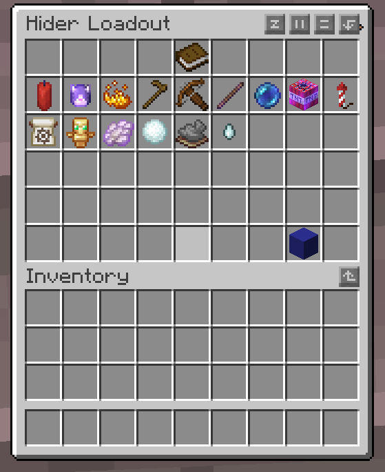
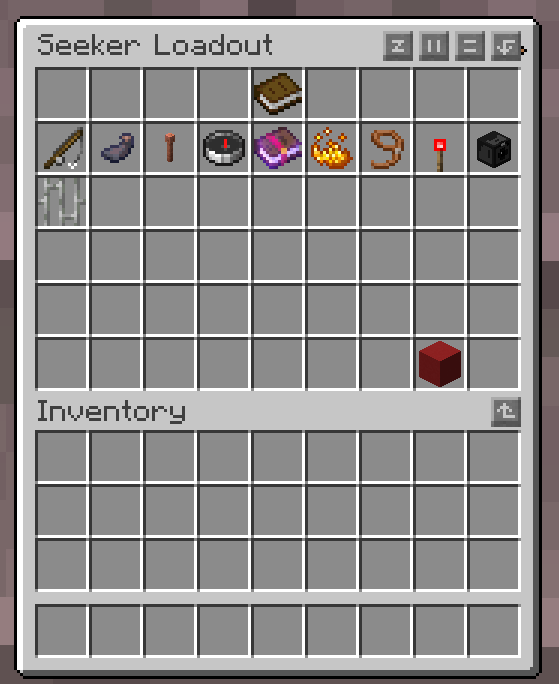

> A customizable Minecraft Hide and Seek minigame plugin, with custom items, loadouts,
> cosmetics, and multiple game modes.

---

## Table of Contents

- [Overview](#overview)
- [Screenshots](#screenshots)
- [Game Modes](#game-modes)
- [Features](#features)
- [Requirements](#requirements)
- [Installation](#installation)
- [Configuration](#configuration)
- [Map Setup](#map-setup)
- [Loadout System](#loadout-system)
- [Items Reference](#items-reference)
- [Commands & Permissions](#commands--permissions)
- [NMS Features](#nms-features)
- [Project Structure](#project-structure)
- [Building from Source](#building-from-source)

---

## Overview

HideAndSeek is a Minecraft minigame plugin in which one team hides while the other seeks. Hiders can disguise themselves
as blocks, shrink to a tiny size, or simply rely on good hiding spots, while seekers use a diverse arsenal of utility
items to track, reveal, and eliminate them. The plugin is built on top of MinigameFramework (also developed by me),
which handles phase management, team assignment, and item registration.

The plugin supports custom maps with per-map setting overrides, a lobby voting system for maps and game modes, a
persistent loadout and cosmetic skin system, and an extensive in-game settings GUI provided by MinigameFramework.

---

## Screenshots


*Block mode: hiders disguise as blocks and blend into the environment.*

 

*The loadout screen. Hiders and seekers have separate item pools and token budgets.*


*Block Selector GUI for choosing and customizing your block disguise.*


*The Proximity Sensor, Camera System, and Cage Trap in action.*

---

## Game Modes

| Mode     | Description                                                                                                            |
|----------|------------------------------------------------------------------------------------------------------------------------|
| `NORMAL` | Hiders hide in the map as themselves. Seekers hunt them down using their sword and utility items.                      |
| `BLOCK`  | Hiders disguise as configurable blocks and blend into the scenery. Seekers must spot inconsistencies.                  |
| `SMALL`  | Hiders are scaled down to a configurable size, making them much harder to spot. Seekers can optionally be resized too. |

Game modes can be changed via the in-game settings GUI or voted on by players in the lobby.

---

## Features

### Core Gameplay

- Three distinct game modes: Normal, Block, Small
- Lobby with player readiness checks and map/gamemode voting
- Configurable hiding and seeking phase durations
- World border support with per-map border configurations
- Automatic map cleanup and lobby return after each round
- Points and scoring system with round-end coin rewards
- Boss bar showing remaining hiders during the seeking phase
- Anti-cheat visibility filtering: seekers only see hiders within a configured range and line of sight
- Hider camping detection and punishment system

### Map System

- Multiple maps with per-map configuration (allowed blocks, timings, seeker count, setting overrides)
- Random map selection or player lobby voting
- Automatic world copying and deletion per round
- Per-map world borders, spawn points, and block lists
- Map info title shown at round start (configurable display mode)

### Loadout System

- Players can customize their item selection in the lobby before each round
- Token budget system with five rarity tiers: Common, Uncommon, Rare, Epic, Legendary
- Separate hider and seeker loadout slots and token pools
- Loadout data persisted to `loadout-data.yml` across sessions

### Cosmetic System

- Item skins (variants) purchasable with coins earned from round points
- Each item has multiple skins with unique visual effects, particles, and sounds
- Kill effects system, custom effects played when a seeker kills a hider
- Coin shop with configurable rarity-based prices
- Cosmetic data persisted to `skin-data.yml` across sessions

### Hider Items

Firecracker, Big Firecracker, Firework Rocket, Cat Sound, Speed Boost, Knockback Stick, Tracker Crossbow, Block Swap,
Random Block, Smoke Bomb, Slowness Ball, Invisibility Cloak, Medkit, Totem of Undying, Ghost Essence *(NMS only,
disables without NMS)*

### Seeker Items

Seeker's Blade (chargeable + throwable), Grappling Hook, Ink Splash, Lightning Freeze, Glowing Compass, Curse Spell,
Block Randomizer, Chain Pull, Proximity Sensor, Cage Trap, Camera System *(NMS only, disabled without it)*, Seeker's
Assistant *(NMS only, disabled without it)*

---

## Requirements

| Requirement       | Version |
|-------------------|---------|
| Java              | 21+     |
| Paper (or Purpur) | 1.21.x  |
| MinigameFramework | 1.0.0   |

### MinigameFramework

> [!IMPORTANT]
> HideAndSeek depends on **MinigameFramework**, a companion library also developed by me. **It is not currently publicly
available, neither the JAR nor the source code.**.

> [!NOTE]
> MinigameFramework will be released publicly in the future. This section will be updated when that happens.

---

## Installation

1. Ensure your server runs Paper 1.21.x with Java 21 or newer.
2. Wait until `MinigameFramework.jar` is released and place it in your `plugins/` folder.
3. Place `HideAndSeek-1.0-SNAPSHOT.jar` in your `plugins/` folder.
4. Start the server once to generate config files.
5. Set up at least two scoreboard teams via MinigameFramework's team configuration.
6. Add at least one map (see [Map Setup](#map-setup)).
   7.. Restart the server.

### Quick Checklist

- [ ] Java 21+ on the server
- [ ] Paper 1.21.x server jar
- [ ] `MinigameFramework.jar` in `plugins/`
- [ ] `HideAndSeek-1.0-SNAPSHOT.jar` in `plugins/`
- [ ] Two teams configured in MinigameFramework
- [ ] At least one map entry in `plugins/HideAndSeek/maps.yml`
- [ ] Server restarted after first run

---

## Configuration

The plugin generates `config.yml` and `maps.yml` in `plugins/HideAndSeek/` on first run.

### How settings work

All gameplay settings are managed through the **in-game settings GUI**, provided by MinigameFramework. The `config.yml`
file only serves to override the default value of a setting. If a setting is not present in `config.yml`, the plugin's
built-in default is used instead. Changes made in the GUI take effect imassets/clipstely but do **NOT** persist across
restarts.

### Top-level config keys

```yaml
# Hide & Seek Plugin Configuration

# List of available map world names
# These must match the world names in maps.yml
maps:
  - "map1"
  - "map2"

# NOTE: Map-specific configuration (spawn-points, allowed-blocks, world-borders, preferred-modes)
# is saved in maps.yml. See that file for per-map settings.

# Global disallowed blockstate properties
# Properties listed here won't appear in the appearance GUI for ANY block
disallowed-blockstates:
  - "waterlogged"
  - "conditional"

seeker-break-blocks:
  - "SHORT_GRASS"
  - "TALL_GRASS"
  - "SEAGRASS"
  - "TALL_SEAGRASS"

block-interaction-exceptions:
  - "*_DOOR"
  - "*_FENCE_GATE"
  - "*_TRAPDOOR"
  - "*_BUTTON"
  - "*_LEVER"

block-physics-exceptions:
  - "*_DOOR"
  - "*_FENCE_GATE"
  - "*_TRAPDOOR"
  - "*_BUTTON"
  - "*_LEVER"

nms:
  # Master switch: attempt to load NMS adapter. If true, plugin will try to enable NMS features
  # on startup. If adapter missing or fails, behavior depends on fallbacks.
  enabled: true

  # Game settings
game:
  # Apply player facing direction to placed blockstate in BLOCK mode
  # true = align facing/axis/rotation/half with player look
  # false = keep the chosen blockstate exactly as selected in the appearance GUI
  apply-player-direction: true

  # Maximum air blocks above water/lava that still allow hiding placement
  max-air-above-liquid: 2

persistence:
  save-skin-data: true
  save-loadout-data: true

settings:
# Leave this section empty to use plugins defaults. To override a specific
# default value for a setting, add the key under this node and set the desired value. For example:
#  hider-items:
#    random-block:
#      uses: 10
#  game:
#    use_map_specific_setting_overrides: true
# This will set the default value for the random-block setting to 10. Though this still can be changed in the
# ingame settings menu.
```

### Overriding setting defaults

Any setting shown in the in-game GUI can have its default value overridden in `config.yml` under the `settings:` key.
For example:

```yaml
settings:
  game.mode: BLOCK
  game.hiding-time: 90
  game.seeking-time: 240
  game.hiders.health: 10
  anticheat.seeking.visibility-range: 16.0
  loadout.hider-max-items: 4
  loadout.hider-max-tokens: 14
  hider-items.speed-boost.cooldown: 15
  seeker-items.glowing-compass.cooldown: 30
  points.hider.survival.amount: 10
```

A full list of available setting keys can be found in [
`SettingRegisterer.java`](plugin/src/main/java/de/thecoolcraft11/hideAndSeek/util/setting/SettingRegisterer.java).

---

## Map Setup

Maps are defined in `plugins/HideAndSeek/maps.yml`. Each key is the internal map name and must match the name of a world
folder present on the server.

```yaml
# Maps Configuration
# This file contains imported map configurations with detailed settings
# Each map can have its own spawn points, world borders, allowed blocks, and preferred game modes

# Format:
# world-name:
#   pretty-name: "Ancient Ruins"                    # Optional: Player-facing map title shown in GUI/titles
#   description: "A brief description of the map"
#   author: "Map Creator"                          # Optional: Name of the map creator
#   size: "MEDIUM"                                 # Optional: Map size - SMALL, MEDIUM, LARGE
#   spawn-points:
#     - "x,y,z,yaw,pitch"
#     - "x2,y2,z2,yaw2,pitch2"
#   world-borders:
#     - "centerX,centerZ,radius"
#   preferred-modes:
#     - "NORMAL"
#     - "BLOCK"
#   allowed-blocks:
#     - "STONE"
#     - "DIRT"
#     - "*CANDLE{RED_CANDLE}"
#     - "OAK_LOG[*]"
#     - "OAK_TRAPDOOR[half,open,facing]"
#   seeker-break-blocks:                            # Optional: Per-map seeker break list (falls back to config.yml)
#     - "SHORT_GRASS"
#     - "TALL_GRASS"
#   block-interaction-exceptions:                   # Optional: Per-map interaction exception list
#     - "*_DOOR"
#     - "*_BUTTON"
#   block-physics-exceptions:                       # Optional: Per-map physics exception list
#     - "*_DOOR"
#     - "*_BUTTON"
#   setting-overrides:                              # Optional: Override any setting key for this map during rounds
#     game:
#       hider_invisibility: true
#       hider_health: 16
#   players:                                       # Optional: Player count recommendations
#     min: 4                                       # Minimum players for this map
#     recommended: 8                               # Recommended number of players
#     max: 16                                      # Maximum players for this map
#   seekers:                                       # Optional: Seeker configuration
#     min: 1                                       # Minimum number of seekers
#     per-players: 8                               # Add 1 seeker per X players (0 = disabled)
#     max: 4                                       # Maximum number of seekers
#   timings:                                       # Optional: Recommended game timings
#     hiding-time: 60                              # Recommended hiding time in seconds
#     seeking-time: 300                            # Recommended seeking time in seconds

# Note: If spawn-points and world-borders have equal counts, they are matched by index
# Example: Spawn 1 → Border 1, Spawn 2 → Border 2, etc.
# If counts are different, all spawns will use the first border.

# Configuration patterns for allowed-blocks:
# - Simple material:                 "STONE", "DIRT"
# - All variants (e.g., all candles): "*CANDLE{RED_CANDLE}"  (shows RED_CANDLE in selector, all colors in appearance GUI)
# - All blockstates:                  "OAK_LOG[*]"  (allows all axis rotations)
# - Specific properties allowed:      "CANDLE[lit,candles]"  (only lit & candles customizable)

# Map 1: Default map
map1:
  pretty-name: "Starter Valley"
  description: "Default map"
  author: "Server Admin"
  size: "MEDIUM"
  spawn-points:
    - "0,65,0,0,0"     # Format: x,y,z,yaw,pitch
  world-borders: [ ]    # Optional, format: centerX,centerZ,radius
  preferred-modes:
    - "BLOCK"
  seeker-break-blocks:
    - "SHORT_GRASS"
    - "TALL_GRASS"
  block-interaction-exceptions:
    - "*_DOOR"
    - "*_FENCE_GATE"
    - "*_TRAPDOOR"
    - "*_BUTTON"
    - "*_LEVER"
  block-physics-exceptions:
    - "*_DOOR"
    - "*_FENCE_GATE"
    - "*_TRAPDOOR"
    - "*_BUTTON"
    - "*_LEVER"
  setting-overrides:
    hider-items:
      firework-rocket:
        target-y: 64
  players:
    min: 4
    recommended: 8
    max: 16
  seekers:
    min: 1
    per-players: 8
    max: 4
  timings:
    hiding-time: 60
    seeking-time: 300
  allowed-blocks:
    - "STONE"
    - "DIRT"
    - "GRASS_BLOCK"
    - "COBBLESTONE"
    - "OAK_LOG[*]"
    - "OAK_PLANKS"
    - "*CANDLE{RED_CANDLE}"
    - "OAK_TRAPDOOR[half,open,facing]"


```

### Block Pattern Syntax

The `allowed-blocks` list accepts a pattern DSL for flexible block selection:

| Pattern                        | Meaning                                                   |
|--------------------------------|-----------------------------------------------------------|
| `STONE`                        | Exactly the `STONE` material                              |
| `OAK_SLAB[type=bottom]`        | Oak slab locked to a specific block state                 |
| `OAK_SLAB[*]`                  | Oak slab with any block state allowed                     |
| `*SLAB{OAK_SLAB}`              | All slab variants, defaulting to Oak Slab                 |
| `*SLAB{OAK_SLAB}[type=bottom]` | All slab variants, default Oak Slab, locked block state   |
| `#planks{OAK_PLANKS}`          | All blocks in the `planks` Bukkit tag, default Oak Planks |
| `{STONE,GRANITE,DIORITE}`      | Explicit custom material list                             |

---

## Loadout System

Players configure their loadout in the lobby before each round. Each item has a rarity that determines its token cost.

| Rarity    | Default Token Cost |
|-----------|--------------------|
| Common    | 1                  |
| Uncommon  | 2                  |
| Rare      | 4                  |
| Epic      | 6                  |
| Legendary | 10                 |

By default, hiders have 12 tokens and up to 3 item slots. Seekers have 12 tokens and up to 4 item slots. All values are
configurable via the in-game settings GUI or under `settings.loadout.*` in `config.yml`.

---

## Items Reference

### Hider Items

| Item               | Rarity    | Without NMS | Description                                                              |
|--------------------|-----------|-------------|--------------------------------------------------------------------------|
| Firecracker        | Common    | Full        | Place a small exploding candle taunt for points                          |
| Cat Sound          | Common    | Full        | Play a loud cat sound to all online players                              |
| Random Block       | Common    | Full        | Reroll your disguise block (limited uses)                                |
| Speed Boost        | Common    | Full        | Gain a speed effect or velocity burst                                    |
| Tracker Crossbow   | Common    | Full        | Shoot seekers to earn points and upgrade items                           |
| Knockback Stick    | Common    | Full        | Knock seekers away; upgrades when crossbow hits threshold                |
| Firework Rocket    | Uncommon  | Full        | Launch a high-altitude firework taunt                                    |
| Slowness Ball      | Uncommon  | Full        | Throw a projectile that slows seekers                                    |
| Smoke Bomb         | Uncommon  | Full        | Throw a smoke cloud for visual cover                                     |
| Block Swap         | Rare      | Full        | Swap block disguise with the nearest other hider                         |
| Big Firecracker    | Rare      | Full        | Large explosion with bouncing mini firecrackers                          |
| Medkit             | Rare      | Full        | Hold block to channel-heal; release early to cancel                      |
| Ghost Essence      | Rare      | Disabled    | Phase through walls briefly; falls back to limited behaviour without NMS |
| Invisibility Cloak | Epic      | Full        | Turn invisible for a configurable duration                               |
| Totem of Undying   | Legendary | Full        | Activate a one-time revive window on death                               |

### Seeker Items

| Item               | Rarity    | Without NMS | Description                                               |
|--------------------|-----------|-------------|-----------------------------------------------------------|
| Grappling Hook     | Common    | Full        | Cast and reel in to launch yourself forward               |
| Curse Spell        | Uncommon  | Full        | Empower your sword to curse hiders on hit                 |
| Chain Pull         | Uncommon  | Full        | Pull the hider in front of you to your position           |
| Proximity Sensor   | Rare      | Full        | Place a sensor that glows hiders who walk into range      |
| Ink Splash         | Rare      | Full        | Blind all hiders within a radius                          |
| Cage Trap          | Rare      | Full        | Place a hidden trap that cages and immobilises a hider    |
| Block Randomizer   | Epic      | Full        | Force all hiders to imassets/clipstely reroll their block |
| Glowing Compass    | Epic      | Full        | Reveal the nearest hider with a glow effect               |
| Camera             | Epic      | Disabled    | Place up to 5 cameras and spectate through them           |
| Lightning Freeze   | Legendary | Fallback    | Freeze all hiders in place for a short duration           |
| Seeker's Assistant | Legendary | Disabled    | Summon an AI hunting mob that tracks and shoots hiders    |

---

## Commands & Permissions

| Command          | Description                          |
|------------------|--------------------------------------|
| `/mg map <name>` | Set or view the current map          |
| `/mg loadout`    | Open the loadout selection GUI       |
| `/mg ready`      | Toggle your ready state in the lobby |
| `/mg vote`       | Open the map/gamemode voting GUI     |
| `/mg skin`       | Open the item skin shop              |

> **Note:** Full permission nodes and admin commands will be documented here once MinigameFramework's command API is
> finalized.

---

## NMS Features

The plugin loads a version-specific NMS adapter at startup via `NmsLoader`. Items and features that depend on NMS either
disable themselves entirely or fall back to vanilla behavior: the plugin always starts and runs normally regardless.

| Capability                                                       | Behaviour without NMS                                                         |
|------------------------------------------------------------------|-------------------------------------------------------------------------------|
| Client gamemode spoofing (appear in survival while in spectator) | Ghost Essence falls back to limited behaviour                                 |
| Mob pathfinding API                                              | Ghost Essence falls back; Seeker's Assistant is disabled                      |
| Client camera entity spoofing                                    | Camera item is disabled entirely                                              |
| Client entity glowing packets                                    | Camera night-vision mode unavailable                                          |
| Client entity spawning packets                                   | Camera item is disabled entirely                                              |
| Custom entity AI goals                                           | Seeker's Assistant is disabled entirely                                       |
| Projectile entity raycast for hit detection                      | Seeker's Blade throw falls back to vanilla raycast                            |
| Client lightning packet                                          | Lightning Freeze uses a server-side lightning bolt visible only to the target |

The current NMS implementation targets **Paper 1.21.x** (`nms-v1_21_R7`). Adding support for another version requires a
new Gradle module implementing the `NmsAdapter` interface.

---

## Project Structure

The repository is a multi-module Gradle project:

```
HideAndSeek/
├── plugin/          # Core plugin logic: items, phases, GUIs, listeners, commands
├── nms/             # NMS API module: NmsAdapter interface, NmsLoader, NoopNmsAdapter fallback
├── nms-v1_21_R7/    # Version-specific NMS implementation for Paper 1.21.x
├── build.gradle     # Root build file
└── settings.gradle  # Module declarations
```

The `nms` module defines the `NmsAdapter` interface and a `NoopNmsAdapter` that provides safe no-op fallbacks. The
`nms-v1_21_R7` module contains the live implementation including the custom `SeekerAssistantEntity` and its AI goal
classes. The `plugin` module depends on both and is bundled into a single shadow JAR at build time.

---

## Building from Source

### Prerequisites

- Java 21 JDK
- Git
- `MinigameFramework.jar`: **not publicly available**; will be released soon

### Steps

1. Clone the repository:
   ```bash
   git clone https://github.com/TheCoolcraft11/HideAndSeek.git
   cd HideAndSeek
   ```

2. Install `MinigameFramework.jar` into your local Maven cache so Gradle can resolve it. Replace the version with
   whatever the author provides:
   ```bash
   mvn install:install-file \
   -Dfile=/path/to/MinigameFramework.jar \
   -DgroupId=de.thecoolcraft11 \
   -DartifactId=minigameframework \
   -Dversion=1.0-SNAPSHOT \
   -Dpackaging=jar
   ``` 
   (Linux/Mac)

   ```cmd
   mvn install:install-file
    -Dfile=C:\path\to\MinigameFramework.jar
    -DgroupId=de.thecoolcraft11 -DartifactId=minigameframework 
   -Dversion=1.0-SNAPSHOT 
   -Dpackaging=jar
    ```
   (Windows)

3. Build the plugin:
   ```bash
   ./gradlew shadowJar
   ```
   On Windows:
   ```bash
   gradlew.bat shadowJar
   ```

4. The output JAR will be at:
   ```
   plugin/build/libs/HideAndSeek-1.0-SNAPSHOT.jar
   ```

5. Copy the JAR to your server's `plugins/` directory alongside `MinigameFramework.jar`.
